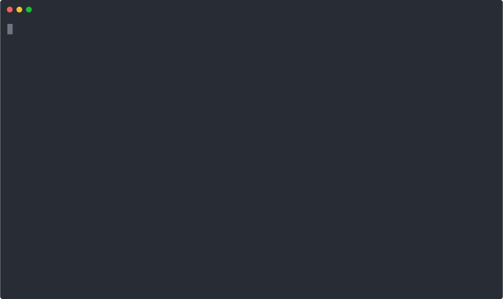

[](https://github.com/plesk/pleskapp/actions?query=workflow%3Atest)
[](https://goreportcard.com/report/github.com/plesk/pleskapp)
[](https://github.com/plesk/pleskapp/)

# PleskApp CLI

PleskApp CLI is a tool that is installed on your local machine (not on the Plesk one) to manage Plesk remotely
from the console. Target audiences are experienced administrators and developers who like to speed up the
operations, automate routine procedures, manage the things using CLI.

Current development status is "early alpha version".

# Demo



# Features

Here is the list of features:
* `plesk servers` - Manage known servers
* `plesk login` - Automatic login to the server (in the browser)
* `plesk ssh` - Login to server using SSH
* `plesk domains` - Manage domains on the server
* `plesk databases` - Manage databases on the server
* `plesk web` - Run local web server to serve current directory
* `plesk deploy` - Deploy the app from the current directory to default server
* Bash and ZSH autocompletion support

# Installation

Here is the command to install the utility:

```
curl -fsSL https://raw.githubusercontent.com/plesk/pleskapp/master/install.sh | bash
```

The utility will be installed to `/usr/local/bin/` directory, so please make sure the path is present in PATH
environment variable. To test it one can use the following command:

```
plesk version
```

Alternative way if you have Go 1.16+ installed:

```
go install github.com/plesk/pleskapp/plesk
```

# How to Build

The utility is written in Go, so the corresponding toolchain should be installed first.

There is a Makefile with bunch of targets. One can use the following command to build the binary:

```
make
```

